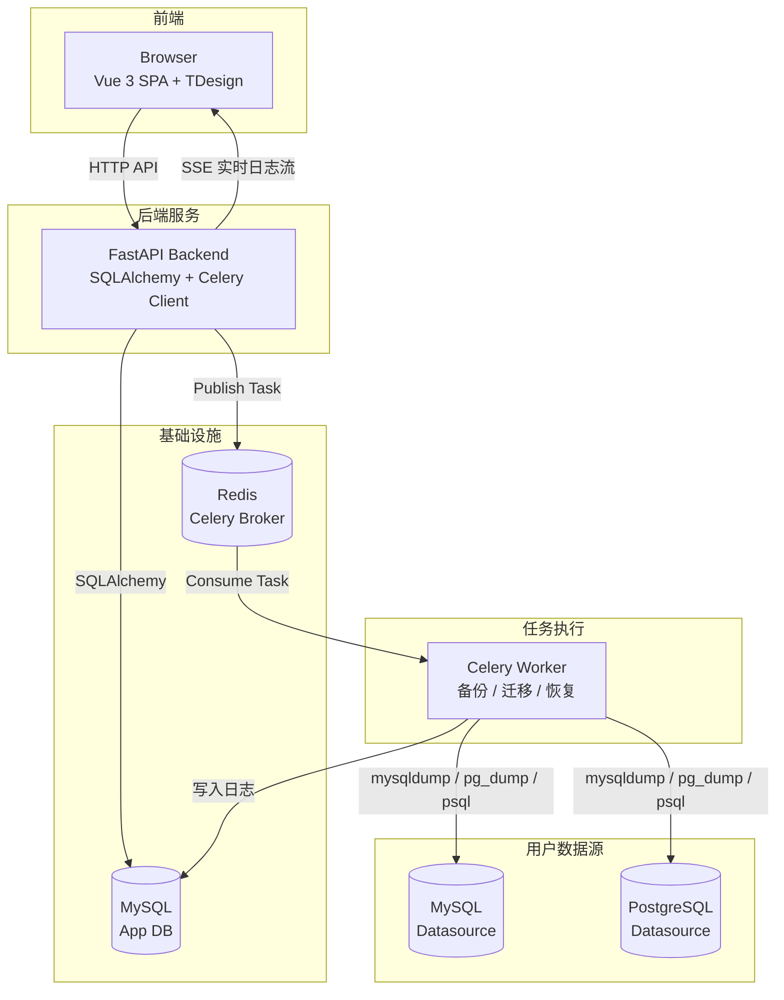

# DBSync

> 基于 Web 的数据库备份、恢复与迁移管理平台

DBSync 提供直观的可视化界面来管理 MySQL/PostgreSQL 数据源，创建定时备份任务（支持全量与增量），执行跨数据库类型的数据迁移，以及通过实时日志流监控所有操作。


---

## 功能特性

### 数据源管理
- 支持 **MySQL** 和 **PostgreSQL** 数据源
- 完整的 CRUD 操作，支持启用/禁用状态切换
- 密码使用 **AES-256-GCM** 加密存储
- 内置连接测试功能
- SSL 配置与额外连接参数支持

### 备份管理
- **全量备份** 与 **增量备份**
- **基于 Cron 的定时调度** — 可视化 Cron 表达式编辑器
- 压缩存储与 **SHA-256** 校验和验证
- 灵活的 **保留策略**（自动清理过期备份）
- 一键手动触发备份
- 备份恢复至原始数据源或自定义目标

### 迁移管理
- **MySQL ↔ PostgreSQL** 跨数据库类型迁移
- 支持三种传输模式：仅结构 / 仅数据 / 结构+数据
- 表级别过滤（包含/排除列表）
- 自动数据类型映射
- 批量插入（1000 行/批），失败自动回退逐行插入

### 监控与日志
- **实时日志流** — 基于 SSE（Server-Sent Events）推送
- **WebSocket** 实时浏览器通知
- 任务级与流程级日志记录
- 恢复记录聚合视图

### 仪表盘
- KPI 概览卡片（数据源统计、任务统计、运行中任务数）
- 最近 10 条活动记录（备份 + 迁移合并展示）

---

## 技术栈

| 层级 | 技术 |
|------|------|
| **后端框架** | [FastAPI](https://fastapi.tiangolo.com/) + SQLAlchemy (async) |
| **任务队列** | [Celery](https://docs.celeryq.dev/) + Redis |
| **数据库** | MySQL 8.0 / PostgreSQL |
| **ORM** | SQLAlchemy 2.0 (asyncio) |
| **前端** | [Vue 3](https://vuejs.org/) + TypeScript + [TDesign](https://tdesign.tencent.com/) |
| **状态管理** | Pinia |
| **构建工具** | Vite 6 |
| **容器化** | Docker Compose（开发 + 生产） |
| **密码学** | cryptography (AES-256-GCM) |

---

## 快速开始

### 前置要求

- Docker & Docker Compose（推荐）
- 或 Python 3.12+、Node.js 22+（直接运行）

### 使用 Docker Compose（推荐）

```bash
# 克隆仓库
git clone <repo-url>
cd dbsync

# 配置环境变量
cp .env.example .env
# 编辑 .env 中的数据库密码和加密密钥

# 启动所有服务
docker compose up -d

# 访问前端
open http://localhost:5173

# 查看 API 文档
open http://localhost:8000/docs
```

### 手动运行

#### 后端

```bash
cd backend
python -m venv venv
source venv/bin/activate
pip install -r requirements.txt

# 确保 MySQL 和 Redis 已启动

# 启动 FastAPI 服务
uvicorn app.main:app --reload

# 启动 Celery Worker（新终端）
celery -A app.worker.app worker --loglevel=info

# 启动 Celery Beat 调度器（新终端）
celery -A app.worker.app beat --loglevel=info
```

#### 前端

```bash
cd frontend
npm install
npm run dev
```

### 生产部署

```bash
docker compose -f docker-compose.prod.yml up -d
# 访问 http://localhost:80
```

---

## 项目结构

```
dbsync/
├── backend/                    # FastAPI 后端
│   ├── app/
│   │   ├── api/                # REST API 路由
│   │   ├── core/               # 配置、数据库、安全
│   │   ├── models/             # SQLAlchemy 数据模型
│   │   ├── schemas/            # Pydantic 请求/响应模型
│   │   └── worker/             # Celery 任务（备份/迁移/恢复）
│   ├── alembic/                # 数据库迁移
│   └── tests/                  # 后端测试
├── frontend/                   # Vue 3 前端
│   └── src/
│       ├── api/                # API 客户端
│       ├── components/         # 公共组件
│       ├── stores/             # Pinia 状态管理
│       ├── views/              # 页面视图
│       └── router/             # 路由配置
├── docker/                     # Nginx 配置
├── docker-compose.yml          # 开发环境
├── docker-compose.prod.yml     # 生产环境
└── docker-compose.test.yml     # 测试环境
```

---

## 服务架构



---

## 运行测试

```bash
# 后端测试
cd backend
pytest tests/

# 前端测试
cd frontend
npm run test:unit
```

---

## API 文档

启动后端后访问：

- **Swagger UI**: http://localhost:8000/docs
- **ReDoc**: http://localhost:8000/redoc

---

## 许可证

[MIT](LICENSE)
